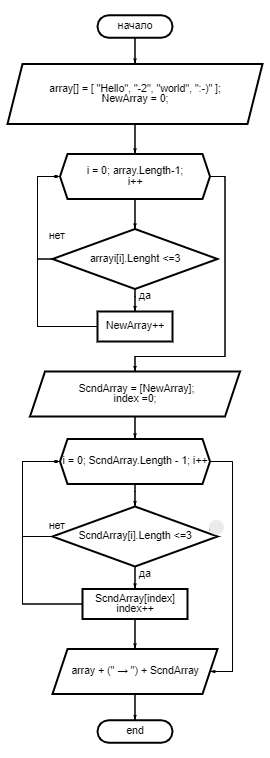
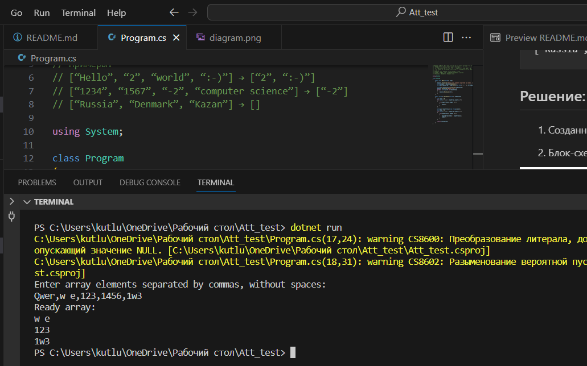
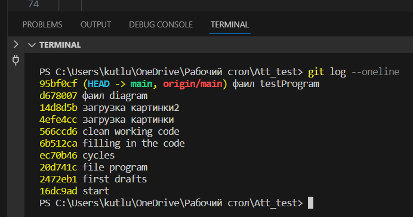

# Итоговая контрольная работа по основному блоку

## Необходимые действия:

1. Создать репозиторий на GitHub.
2. Нарисовать блок-схему алгоритма.
3. Снабдить репозиторий оформленным текстовым описанием решения (файл README.md).
4. Написать программу, решающую поставленную задачу.
5. Использовать контроль версий в работе над этим небольшим проектом.

## Задача:

Написать программу, которая из имеющегося массива строк формирует новый массив из строк, длина которых меньше, либо равна 3 символам. Первоначальный массив можно ввести с клавиатуры, либо задать на старте выполнения алгоритма. При решении не рекомендуется пользоваться коллекциями, лучше обойтись исключительно массивами.

### Примеры:
```
[“Hello”, “2”, “world”, “:-)”] → [“2”, “:-)”]
[“1234”, “1567”, “-2”, “computer science”] → [“-2”]
[“Russia”, “Denmark”, “Kazan”] → []
```

## Решение:

1. Созданный  репозиторий: **Att_test**

2. Блок-схема алгоритма: 



3. Текстовое описание решения (файл **README.md**).

4. Программа находится в ветке [`main`](https://github.com/Kutlubaeva6/Att_test/blob/main/Program.cs "Открыть решение")
Код программы:
```cs
using System;

class Program
{
    static void Main(string[] args)
    {
        Console.WriteLine("Enter array elements separated by commas, without spaces: ");
        string input = Console.ReadLine();
        string[] inputArray = input.Split(new char[] { ',' }, StringSplitOptions.RemoveEmptyEntries);

        string[] resultArray = FilterStr(inputArray);
        Console.WriteLine("Ready array: ");
        foreach (string str in resultArray)
        {
            Console.WriteLine(str);
        }
    }

    static string[] FilterStr(string[] inputArray)
    {
        int count = 0;
        for (int i = 0; i < inputArray.Length; i++)
        {
            if (inputArray[i].Length <= 3)
            {
                count++;
            }
        }

        string[] resultArray = new string[count];
        int index = 0;
        for (int i = 0; i < inputArray.Length; i++)
        {
            if (inputArray[i].Length <= 3)
            {
                resultArray[index] = inputArray[i];
                index++;
            }
        }

        return resultArray;
    }
}
```
5. Результат вывода:



6. Коммииты:

